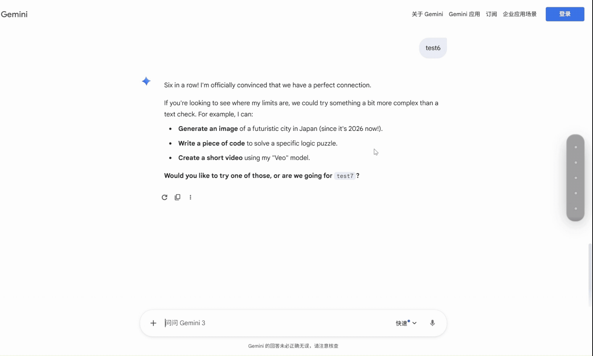

# Conversation Navigation Bar

一个 Chrome 扩展，为 ChatGPT 和 Gemini 添加聊天导航条功能。当对话很长时，可以通过右侧的导航条快速跳转到任意一条用户提问。



## ✨ 功能特点

- 🎯 **快速导航**：在页面右侧显示所有用户提问的列表，点击即可跳转
- 🔄 **实时更新**：当你发送新消息时，导航条会自动更新
- 🎨 **优雅设计**：采用毛玻璃效果的现代 UI，悬停展开显示完整内容
- 📍 **当前位置指示**：高亮显示当前可见的提问
- 🌐 **多平台支持**：同时支持 ChatGPT 和 Gemini

## 📦 安装方法

### 开发者模式安装

1. 下载或克隆本项目到本地
2. 打开 Chrome 浏览器，访问 `chrome://extensions/`
3. 开启右上角的「开发者模式」
4. 点击「加载已解压的扩展程序」
5. 选择本项目的文件夹
6. 刷新 ChatGPT 或 Gemini 的对话页面

## 🚀 使用方法

1. 打开 [ChatGPT](https://chatgpt.com) 或 [Gemini](https://gemini.google.com)
2. 进入任意一个历史对话
3. 页面右侧会自动显示导航条（收起状态为小圆点列表）
4. 将鼠标悬停在导航条上，会展开显示每条提问的摘要
5. 点击任意条目，页面会平滑滚动到对应的提问位置

## 📁 项目结构

```
Conversation navigation bar/
├── manifest.json           # Chrome 扩展配置文件
├── icons/                  # 扩展图标（用于Chrome扩展管理页面显示）
│   ├── icon16.png
│   ├── icon48.png
│   └── icon128.png
└── src/
    └── content/
        ├── content-script.js   # 核心逻辑脚本
        └── navigation.css      # 导航条样式
```

> **注意**：`icons/` 文件夹中的图标是 Chrome 扩展所必需的，用于在浏览器工具栏和扩展管理页面中显示。导航条本身不使用这些图标，而是采用纯 CSS 样式。

## 🔧 技术实现

- **消息检测**：使用特定的 DOM 选择器检测用户消息
  - Gemini: `user-query`, `.query-text`, `.conversation-container`
  - ChatGPT: `[data-message-author-role="user"]`
- **实时更新**：使用 `MutationObserver` 监听 DOM 变化
- **平滑滚动**：使用 `scrollIntoView` API 实现平滑跳转
- **当前位置**：使用 `IntersectionObserver` 检测可见元素

## 🐛 调试

打开浏览器开发者工具（F12），在控制台中可以看到以 `[OCN]` 开头的调试日志。

如果导航条没有显示，请检查：
1. 是否在 ChatGPT 或 Gemini 的对话页面中
2. 页面中是否有用户消息
3. 控制台是否有错误信息

## 🤝 贡献

欢迎提交 Issue 和 Pull Request！
